# 🔗 Integration Guide: Horizon Brand Builder + Brand Quality Auditor

## 🎯 Two-Tool Workflow

### **Tool 1: Horizon Brand Builder** (Fast Generation)
- Purpose: Generate brand strategies quickly
- Focus: Creative output, speed
- Time: 2-5 minutes

### **Tool 2: Brand Quality Auditor** (Quality Verification)
- Purpose: Deep quality verification
- Focus: Source verification, fact-checking
- Time: 30 seconds - 5 minutes

---

## 📊 Complete Workflow

### **Step 1: Generate Strategy** (Horizon Brand Builder)

```bash
cd ~/Development/horizon-brand-builder

# Quick generation (2-5 min)
npm run fast -- --brand "Enterprise Client" --industry "Technology"

# Or comprehensive generation (15-30 min)
npm run professional -- --brand "Enterprise Client" --industry "Technology"
```

**Output**: `output/enterprise-client/strategy/brand-strategy.json`

---

### **Step 2: Audit Quality** (Brand Quality Auditor)

```bash
cd ~/Development/brand-quality-auditor

# Basic audit (30 sec)
npm run audit -- \
  --input ../horizon-brand-builder/output/enterprise-client/strategy/brand-strategy.json

# Comprehensive audit (2-3 min)
npm run audit -- \
  --input ../horizon-brand-builder/output/enterprise-client/strategy/brand-strategy.json \
  --mode comprehensive \
  --format both \
  --output enterprise-client-audit.md
```

**Output**:
- `enterprise-client-audit.md` (Markdown report)
- `enterprise-client-audit.json` (JSON data)

---

### **Step 3: Review & Fix**

1. Open audit report: `open enterprise-client-audit.md`
2. Review critical issues and warnings
3. Fix issues in original strategy
4. Save as `brand-strategy-v2.json`

---

### **Step 4: Re-Audit** (Verify Improvements)

```bash
npm run audit -- \
  --input ../horizon-brand-builder/output/enterprise-client/strategy-v2.json \
  --output enterprise-client-audit-v2.md
```

Compare scores:
- v1: 3.8/10 ❌
- v2: 8.2/10 ✅ (after fixes)

---

## 🎨 Use Case Examples

### **Use Case 1: MVP Launch** (Speed Priority)

```bash
# Generate only, no audit
cd horizon-brand-builder
npm run fast -- --brand "Startup XYZ"
# Use strategy immediately ✅
```

**Time**: 2-5 min
**Quality**: Good enough for MVP

---

### **Use Case 2: Client Deliverable** (Quality Priority)

```bash
# 1. Generate
cd horizon-brand-builder
npm run professional -- --brand "Enterprise Client"

# 2. Audit
cd ../brand-quality-auditor
npm run audit -- \
  --input ../horizon-brand-builder/output/enterprise-client/strategy.json \
  --mode comprehensive

# 3. Fix issues
# (edit strategy based on audit recommendations)

# 4. Re-audit
npm run audit -- --input strategy-v2.json
```

**Time**: 20-40 min (including fixes)
**Quality**: Consulting-grade ✅

---

### **Use Case 3: Board Presentation** (Maximum Quality)

```bash
# 1. Generate
cd horizon-brand-builder
npm run professional -- --brand "Company Board Deck"

# 2. Comprehensive audit with web verification
cd ../brand-quality-auditor
npm run audit -- \
  --input ../horizon-brand-builder/output/company-board-deck/strategy.json \
  --mode comprehensive \
  --web-search true \
  --format both

# 3. Multiple rounds of fixes and re-audits
# ... until score >= 9.0

# 4. Final audit
npm run audit -- --input strategy-final.json --output board-audit-final.md
```

**Time**: 1-2 hours (including multiple iterations)
**Quality**: Board-ready 🌟

---

## 📁 Directory Structure After Integration

```
~/Development/
├── horizon-brand-builder/              # Tool 1: Generation
│   ├── output/
│   │   └── enterprise-client/
│   │       └── strategy/
│   │           ├── brand-strategy.json         # Generated
│   │           ├── brand-strategy-v2.json      # After fixes
│   │           └── brand-strategy-final.json   # Final version
│   └── ...
│
└── brand-quality-auditor/             # Tool 2: Verification
    ├── audit-report-enterprise-client.md       # Audit v1
    ├── audit-report-enterprise-client-v2.md    # Audit v2
    ├── audit-report-enterprise-client-final.md # Final audit
    └── ...
```

---

## 🔄 Iteration Workflow

```mermaid
graph TD
    A[Generate Strategy] --> B[Audit Quality]
    B --> C{Score >= 8.0?}
    C -->|No| D[Fix Issues]
    D --> B
    C -->|Yes| E[Deliver Strategy ✅]
```



### **Typical Iterations:**

| Round | Score | Action | Time |
|-------|-------|--------|------|
| 1 | 3.8/10 | Identify critical issues | 30 sec |
| 2 | 6.5/10 | Add sources, fix gaps | 20 min |
| 3 | 8.2/10 | Cross-verify claims | 15 min |
| 4 | 9.0/10 | Final polish | 10 min |

**Total**: ~45 min for consulting-grade quality

---

## 🚀 Automation Scripts

### **Quick Audit Script**

```bash
# ~/audit.sh
#!/bin/bash
cd ~/Development/brand-quality-auditor
npm run audit -- \
  --input "$1" \
  --output "$(basename "$1" .json)-audit.md"
```

Usage:
```bash
chmod +x ~/audit.sh
~/audit.sh ~/Development/horizon-brand-builder/output/mybrand/strategy.json
```

### **Full Quality Workflow**

```bash
# ~/quality-workflow.sh
#!/bin/bash
BRAND=$1
INDUSTRY=$2

# Step 1: Generate
cd ~/Development/horizon-brand-builder
npm run professional -- --brand "$BRAND" --industry "$INDUSTRY"

# Step 2: Audit
cd ~/Development/brand-quality-auditor
npm run audit -- \
  --input "../horizon-brand-builder/output/${BRAND}/strategy.json" \
  --brand "$BRAND" \
  --mode comprehensive \
  --format both

echo "✅ Strategy generated and audited!"
echo "📄 Review: audit-report-${BRAND}.md"
```

Usage:
```bash
chmod +x ~/quality-workflow.sh
~/quality-workflow.sh "Enterprise Client" "Technology"
```

---

## 📊 Quality Standards

### **When to Use Which Tool**

| Scenario | Tool(s) | Quality Target | Time Budget |
|----------|---------|---------------|-------------|
| **Internal brainstorm** | Horizon only | 5-6/10 | 5 min |
| **MVP launch** | Horizon only | 6-7/10 | 10 min |
| **Client draft** | Horizon + Auditor | 7-8/10 | 30 min |
| **Client final** | Horizon + Auditor (2 rounds) | 8-9/10 | 1 hour |
| **Board presentation** | Horizon + Auditor (3+ rounds) | 9-10/10 | 2 hours |

---

## 🛠️ Troubleshooting

### **Issue: Audit finds no claims**

```bash
# Check if strategy has the right structure
cat strategy.json | grep -E "proofPoints|differentiators|keyMessages"
```

**Fix**: Ensure strategy has `proofPoints`, `differentiators`, or `keyMessages` arrays.

### **Issue: TypeScript errors in auditor**

```bash
cd ~/Development/brand-quality-auditor
npm run type-check
```

**Fix**: Ensure all dependencies are installed: `npm install`

### **Issue: Low audit score despite good strategy**

**Reason**: Auditor checks for sources/citations, not just content quality.

**Fix**: Add sources to `proofPoints`:
```json
{
  "proofPoints": [
    {
      "claim": "Market leader with 40% share",
      "source": "Gartner Report 2024",
      "sourceUrl": "https://gartner.com/report",
      "confidence": 9
    }
  ]
}
```

---

## 📈 Performance Metrics

### **Horizon Brand Builder** (Lean)
- **Speed**: ⚡ Very Fast (2-5 min)
- **Quality**: 👍 Good (6-7/10)
- **Sources**: ❌ None (LLM-generated)
- **Best For**: Rapid iteration, MVP

### **Brand Quality Auditor** (Ferrari)
- **Speed**: 🏎️ Fast (30 sec - 5 min)
- **Quality**: 🌟 Excellent (verification)
- **Sources**: ✅ Required (tier-based)
- **Best For**: Client delivery, high-stakes

### **Combined Workflow**
- **Speed**: ⚡ Reasonable (20-60 min)
- **Quality**: 🌟 Consulting-grade (8-9/10)
- **Sources**: ✅ Verified
- **Best For**: Production use

---

## 🎯 Next Steps

1. **Test the workflow** with a real brand
2. **Tune quality thresholds** based on your needs
3. **Automate** with shell scripts
4. **Monitor** quality improvements over time

---

**Ready to build quality brand strategies?** 🏎️✨

```bash
# Quick start
cd ~/Development/horizon-brand-builder
npm run fast -- --brand "Test Brand"

cd ~/Development/brand-quality-auditor
npm run audit -- --input ../horizon-brand-builder/output/test-brand/strategy.json
```
